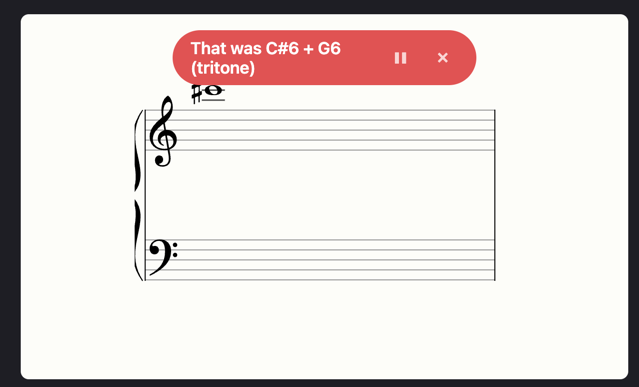

# PrimaVista — Backlog

Ideas for future features, not yet committed to or scheduled. Nothing here is decided — see `SPEC.md` for what's actually shipped and its "Out of scope" lists for related items already ruled out for now.

Items are numbered (`## N: Title`) purely so they can be referenced quickly ("implement 1 and 2"). Numbers come from **Next number** below and are never reused, even after an item ships and is removed — same as GitHub issue/PR numbers, so a number always points to the same idea and gaps in the sequence (after something ships) are expected, not a mistake. Bump **Next number** by one every time an item is added.

**Next number:** 13

## 4: Interval mode: allow intervals bigger than an octave

Interval mode currently caps at 12 semitones (`MAX_INTERVAL_SEMITONES` in `app.js`), i.e. an octave. Raise the cap to include intervals up to a major 10th (16 semitones = octave + major 3rd) — roughly the widest reach playable with one hand, and still useful/realistic to practice reading and judging on the staff, unlike arbitrarily large spans.

## 5: Two hands?
Should then maybe be a rule that left hand is below middle c and right hand above?
TODO: refine

## 11: Show Swedish octave names
In the error message where the user sees the correct tones, it is displayed as below:
C4 - C5. It would be nice to also show the Swedish names of the octaves, even though it might get ugly UX wise, something to test out. 

## 12: Notes hidden by error message
Would be good to be able to see the notes here. This alert isn't always covering.
If it was just right aligned as the green interval info alert, it would probably be fine. 

